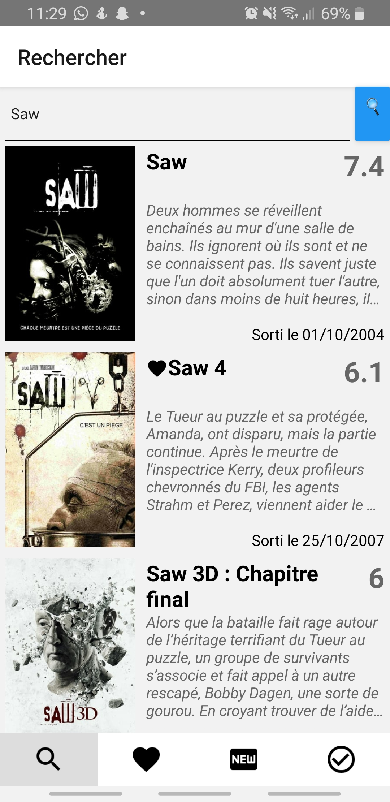
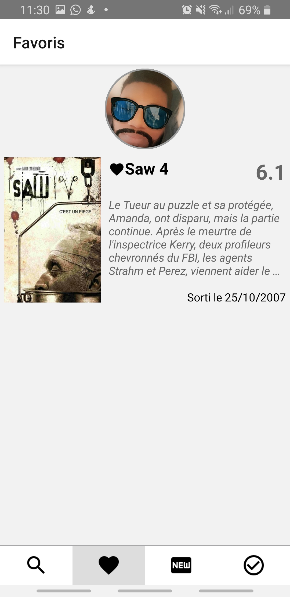
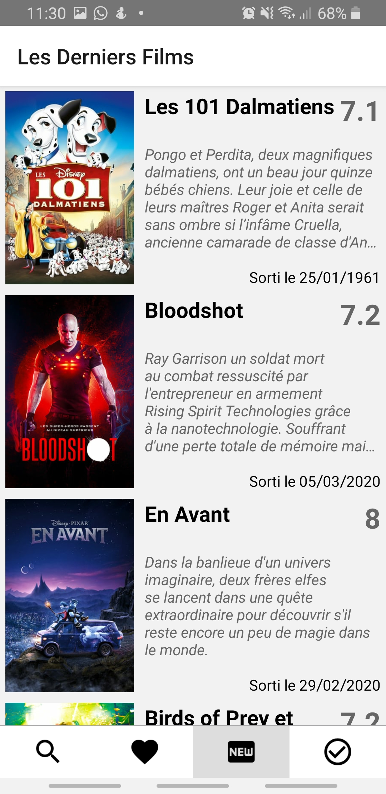
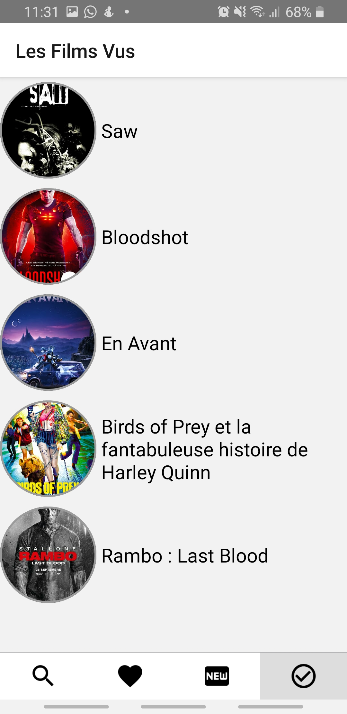
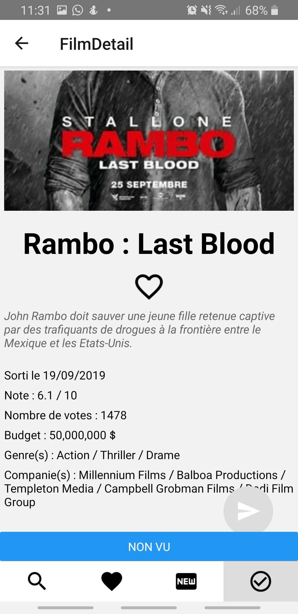
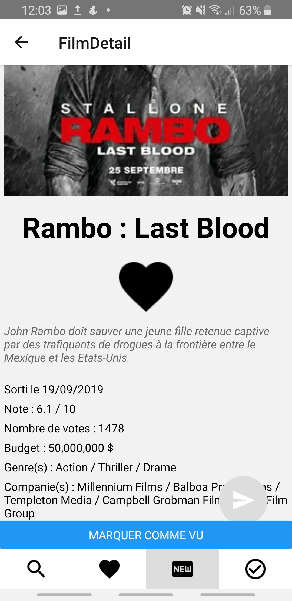

# MoviesAndMe

Application d'apprentissage de react native issu du cours https://openclassrooms.com/fr/courses/4902061-developpez-une-application-mobile-react-native

## Table des matières
* [Technologies](#Technologies)
* [Prérequis](#Prérequis)
* [Lancement](#Lancement)
* [Images](#Images)

## Technologies
* React Native
* Node js
* JSX
* ES6
* Redux

## Prérequis
* Node js à télécharger sur le site https://nodejs.org/fr/download/ puis l'installer. 
* Expo à télécharger sur le Playstore/AppleStore puis l'installer sur votre Android/IOS. 
* Un éditeur de texte (ex: VScode).

## Lancement
1. Lancer la commande ``` $ npm install -g expo-cli  ```
2. Lancer la commande ``` $ npm install -g react-native-cli ```
3. Cloner le projet dans votre répertoire avec la commande ``` $ git clone https://github.com/moubAde/MoviesAndMe.git ```.
4. Lancer la commande ``` $ npm install ``` à partir de la racine du projet MoviesAndMe pour installer les dépendances.
5. Créer un fichier du nom TMDBApiKey.js dans le répertoire MoviesAndMe/API/ puis copier coller le code suivant dans le fichier nouvellement créé  ``` export default API_TOKEN = 'Key' ``` 
6. Dans le fichier TMDBApiKey.js, remplacer la valeur de la valeur "Key" par un Token (ex: xxxxxxxxxxxxxxxxxxxxbc410807af3b) que vous pouvez vous procurer sur le site https://www.themoviedb.org/documentation/api
7. Toujours dans le projet MoviesAndMe, lancer la commande ``` $ react-native run-android ``` pour lancer l'application sur votre device, un émulateur ou un simulateur.

## Images
     
     
     

